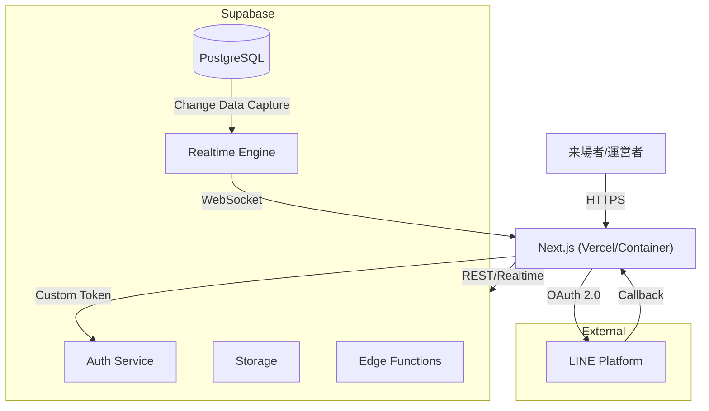

# 文化祭Webサイト 仕様書

---

## 1. システム全体概要

### 1.1 文書概要

本仕様書は、2026年度 長田高等学校文化祭において使用するWebサイトの開発・運用に関する仕様を定義するものである。要件定義書を基に、開発・実装・運用段階での判断基準を明確化し、チーム内外での認識齟齬を防ぐことを目的とする。

### 1.2 システム目的

本システムは以下を目的として構築する。

* 文化祭来場者に対し、必要十分かつ分かりやすい情報を提供する
* 文化祭のシステムにおいて公平性を担保する
* 当日の運営をWebシステムに組み込み、人的負担・混雑・混乱を低減する
* 障害発生時にも運営を阻害しない、安定性を重視した構成とする

### 1.3 想定利用者

* **来場者**（一般来場者、生徒、保護者）  3000人規模
    * 展示情報の閲覧、混雑状況の確認
    * ファストパスの申込・利用
* **運営者**（各クラス出展者、実行委員）  50人規模
    * 出展情報の編集、混雑状況のリアルタイム入力
    * ファストパスの受付・消込処理
* **管理者**（Web開発チーム）            20人規模
    * システム全体の管理、障害対応、データメンテナンス

### 1.4 想定アクセス規模

* 最大同時利用者数：約3,000人
* 校内ネットワーク不安定化を想定し、通信断耐性を考慮する

### 1.5 開発・運用環境

* **コンテナ技術 (Docker) の利用**
  * 開発環境および本番環境の差異を吸収し、安定したデプロイを実現するために Docker を採用する
  * フロントエンド (Next.js) は Docker コンテナとして構築・運用する
  * ローカル開発においても Docker Compose を用いて環境を統一することを推奨する

* **仕様変更に強いアーキテクチャの採用**
  * 開発期間中の仕様変更や機能追加に柔軟に対応できるよう、コンポーネントの再利用性を高め、疎結合な設計を心がける
  * TypeScript の型定義を厳格に運用し、変更時の影響範囲を明確化することで、安全なリファクタリングを可能にする
  * UI ロジックとビジネスロジックを分離（例：Custom Hooks の活用）し、仕様変更時の修正箇所を局所化する

---

## 2. 文言の定義

本プロジェクトおよびコード内で使用する用語と変数名の対応を以下のように統一する。開発時は原則としてこの英語名を変数名・テーブル名・関数名に使用すること。

| 用語（日本語） | 英語名 (Variable Name) | 定義・用途 |
| :--- | :--- | :--- |
| **ユーザーID** | `user_id` | システム内部で一意のUUID。全テーブルでユーザーを参照する際の主キー。 |
| **ログインID** | `login_id` | ユーザーがログインに使用するID（一意）。 `users` テーブルで管理。 |
| **企画 / プロジェクト** | `project` | 文化祭に出展される全てのコンテンツ（模擬店、ステージ、展示）。システムの中核エンティティ。`projects` テーブルで管理。 |
| **クラス** | `class` | 運営主体としてのクラス（1年1組など）。主に「運営者ログイン」の単位として使用する。 |
| **運営者** | `operator` | 各企画の運営担当者（生徒）。 |
| **管理者** | `admin` | 実行委員・開発チーム。 |
| **混雑状況** | `congestion` | `projects` に紐づく混雑度。 |
| **ファストパス** | `fastpass` | `projects` に紐づく優先入場整理券。 |
| **時間枠** | `time_slot` / `slot` | ファストパスが有効な10分刻みの時間帯。 |
| **発券 / チケット** | `issue` / `ticket` | ユーザーが特定のスロットに対して取得した権利。DB上は `tickets` テーブルで管理。 |
| **長田検定** | `ngt_quiz` / `quiz` | 来場者向けミニゲーム機能。 |

* **補足**: 仕様書内で「クラス」「出展」「模擬店」等の表記揺れがある場合は、文脈に応じて上記定義の通り読み替えることとし、コード上は **`project`** (または `booth`) に統一することを推奨する。

## 3. 機能仕様

### 3.0 機能優先度定義

本システムは、開発期間および文化祭当日の安定運用を最優先とし、以下の3段階の機能優先度を定義する。

#### 機能優先度区分

| 区分 | 定義 | 対象機能 |
| :--- | :--- | :--- |
| **ミニマムサクセス** | 文化祭運営に必須。いかなる場合も安定動作させる | 基本情報表示、混雑状況閲覧・入力、運営者ログイン |
| **サクセス** | 目的達成のために可能な限り実装・運用する主要機能 | 情報編集機能、DB連携 |
| **フルサクセス** | 開発リソースに余力がある場合に導入する付加価値機能 | ファストパス機能、長田検定（ミニゲーム） |

#### 運用上の原則

* 上位区分の機能が未完成・停止しても、下位区分の機能は影響を受けない設計とする
* フルサクセス機能は管理者操作により**即時停止可能**であること

### 3.1 来場者向け機能

#### 3.1.1 基本情報表示機能（必須）

---
* レスポンシブ対応（PC / タブレット / スマートフォン）
* 1階層構造（トップページ配下に各セクション）
* 日本語のみ対応
---

本機能は、来場者（在校生・保護者・一般来場者）に対し、文化祭の概要、企画内容、来場時の注意事項およびアクセス情報を、**簡潔かつ視覚的に分かりやすく提供すること**を目的とする。

本機能は以下の情報を一貫したUI設計のもとで表示する。

* 文化祭の正式名称、テーマ、キャッチコピーおよび開催日程
  （校内祭・一般祭の別、日時を明確に区別して表示）
* ステージ企画、模擬店・ブース、展示企画といった主要コンテンツの概要紹介
  （詳細説明ではなく、雰囲気と存在が直感的に伝わる情報量とする）
* 運営に関する注意事項
  （撮影・SNS投稿ルール、落とし物対応、支払い方法等）
* 学校名、公式SNSへの導線、問い合わせに必要な最小限の情報
* 会場所在地、最寄り駅、徒歩所要時間、地図および来場時の注意事項

表示構成は**トップページ配下の1階層構造**とし、
グローバルナビゲーションにより各情報へ即座にアクセス可能とする。

また、本機能は以下の非機能要件を満たすことを必須とする。

* **スマートフォンでの閲覧を最優先**に設計すること
* ファーストビューで開催概要（テーマ・日程）が即座に認識できること
* 不要な装飾・アニメーションを避け、**ページ表示速度を最優先**とすること

本機能は来場者向け機能の中核であり、
文化祭Webサイトにおける全情報は本機能を通じて提供されるものとする。

#### 3.1.2 混雑状況閲覧機能

* 各出展の混雑度を3段階（LVL1〜3）で表示
* 表示形式：3色のアイコン（顔）＋予想待ち時間（分）
* 最終更新日時を表示
* ※ 混雑状況の更新は管理者のみが行い、来場者および運営者は閲覧のみ可能とする。

---

##### 目的

* 来場者を一意に識別し、**一人につき一ユーザ**の利用を担保する
* 主に本ウェブサイトのファストパスの枠取得・長田検定で使用する
* 氏名・メールアドレス等の個人情報を取得せずに認証を実現する

---

##### 適用範囲

以下の機能を利用する際に、本認証機能を必須とする。

* ファストパス取得機能
* ミニゲーム（長田検定）機能

上記ページに未登録ユーザがアクセスした場合、
当該機能の利用前にログインまたは新規登録を要求する。

また、ウェブサイトのヘッダ部分にログイン/登録ボタンを追加する。
認証が完了している場合は、設定したニックネームを表示する。

---

##### 認証方式

* **ID/パスワード認証** を採用する
* ユーザーは任意の **ログインID** と **パスワード** を設定して登録する
* システム内部では、独自に発行した UUID (`user_id`) を主キーとして使用し、全てのデータ紐付けは内部UUIDで行う
* **パスワードは必ずハッシュ化して保存する**（平文保存厳禁）

---

##### 登録フロー

1. 認証が必要な機能ページに未登録ユーザがアクセスする、またはヘッダーの「登録」ボタンを押下する
2. 新規登録画面へ遷移する
3. 以下の情報を入力する
    * **ログインID**（半角英数字、一意）
    * **パスワード**（8文字以上推奨）
    * **ニックネーム**
4. 入力内容をバリデーションし、問題なければDBに保存する
    * ログインIDが重複している場合はエラーを表示し、別のID入力を促す
5. 登録完了後、自動的にログイン状態となり、元の機能ページまたはトップページへ遷移する

---

##### ログインフロー

1. ログイン画面へアクセスする
2. **ログインID** と **パスワード** を入力する
3. DB照合を行い、一致すれば認証成功とする

---

##### 保存するユーザ情報（必須）

認証完了時、以下の情報をユーザ情報として保存する。

* ユーザーID (UUID, PK)
* ログインID (Unique)
* パスワードハッシュ
* ニックネーム
* ユーザ作成日時
* 利用状態フラグ（有効／無効）

※ 氏名、メールアドレス等の個人情報は取得・保存しない。

---

##### 利用制御・安全対策

* ログインIDには **一意制約** を設ける
* 無効化されたユーザは、すべての参加型機能を利用不可とする
* 不正利用が疑われる場合、運営が手動でユーザを無効化できるものとする

---

##### 非機能要件

* 登録・ログイン処理は短時間で完了すること
* パスワードリセット機能は実装しない（「パスワードを忘れたら再登録」運用とするか検討）

---


#### 3.1.5 ファストパス申込機能（発展）

**基本仕様**

* 時間指定制
* QRコード発行
* 文化祭当日のみ有効
* 10分刻みの時間枠

**同時取得制限（重要）**

* 1 ユーザ あたり **未使用のファストパスは同時に1枚まで**
  -> ログイン認証によるユーザ識別を利用
* 未使用チケットが存在する場合、新規発券は不可
* 使用済み（used = true）または失効後に再取得可能
* 未使用チケットの権利を捨てて、失効させることも可能

**模擬店一覧・詳細ページ表示仕様**

* ファストパス導入有無
* 残り枠数の表示
* 枠が0の場合は「売り切れ」と明示

**ステータス表示定義**

| 状態 | 表示文言 |
| :--- | :--- |
| 枠あり | 残り ○ 枠 |
| 枠なし | 売り切れ |
| 当日分終了 | 本日の枠はありません |
| 停止中 | 現在停止中 |
| 非対応 | ファストパス非対応 |

---

#### 3.1.6 長田検定（クイズ）機能（フルサクセス）

**目的**

* **待ち時間の緩和**: 文化祭の長い待ち時間を楽しく過ごすための補助コンテンツ
* **空き時間の有効活用**: 展示や模擬店の間を埋める「暇つぶし」要素
* **回遊性向上**: クイズを通じて長田高校や文化祭についての理解を深める

**コンセプト**

* **「競技」ではなく「自己達成」**: 全来場者が平等に競うのではなく、個々人が楽しみながら称号を目指す設計とする
* **自由な参加スタイル**: 「短時間で1回だけ」「極めるまで何度も」どちらも許容する

**3.1.6.1 クイズ出題仕様**

* 問題は **全校生徒から募集** したものを使用 (目標: 50~100問以上)
  * 「長田高校を知る問題(雑学)」や「中学生範囲の一般教養」を中心とし、初見でも参加しやすい内容とする
* 1プレイにつき **ランダムに10問出題**
* 出題順・問題内容は毎回ランダム

**問題形式（想定）**

* 四択式（正解1つ）
* 1問あたりの配点は固定 1点

**3.1.6.2 称号制度（メイン要素）**

他者との競争ではなく、自身の積み上げを評価する **称号制度** を主軸とする。

| 累積正解数 (仮) | 称号 (仮) | 報酬 |
| :--- | :--- | :--- |
| 10問 | ブロンズ | 限定デジタル壁紙 A |
| 30問 | シルバー | 限定デジタル壁紙 B |
| 60問 | ゴールド | 限定デジタル壁紙 C |
| 100問 | マスター | スペシャル演出 + 壁紙 D |

* 称号到達時に演出を表示し、達成感を提供する
* 順位に関係なく、時間をかければ誰でも到達可能な設計とする

**3.1.6.3 ランキング仕様（サブ要素）**

ランキングはあくまで「全体の盛り上がり演出」および「一部のやり込み勢向け」の参考情報として扱う。

* **表示対象**: **上位 3〜5名 のみ** を表示する
* **表示項目**: 順位、ニックネーム、累計スコア
* **目的**:
  * 「こんなに長時間取り組んだ人がいる」という驚きの提供
  * 過度な競争や、下位ユーザーの劣等感を煽らない配慮

**3.1.6.4 スコア管理仕様**

* 以下のスコアをDBで管理する
* **不正対策**:
  * **Rate Limiting**: スコア送信は「1分間に1回」等の頻度制限を設ける
  * **Answer Hiding**: ブラウザのNetworkタブからのカンニングを防ぐため、正解データは平文ではなく **ソルト付きハッシュ** で送信する
  * **Score Verification**: スコア送信時、改ざん防止用の **署名ハッシュ (HMAC等)** を付与する

| 項目 | 内容 |
| --- | --- |
| highest_score | 1プレイの最高得点 (今回はランキングには使用しない方針だがデータとしては保持) |
| total_score | 累計正解数 (称号およびランキングの基準) |
| play_count | プレイ回数 |

**3.1.6.5 停止仕様**

* 管理者ページから長田検定を一括停止可能
* 停止時は「現在このコンテンツは利用できません」と表示


---

#### 3.1.7 スタッフ紹介ページ

**目的**

* 来場者にスタッフや委員会メンバーを紹介する
* 文化祭Webサイトの信頼性向上
* 来場者との親近感向上

**3.1.7.1 ページ構成**

スタッフ紹介ページは以下の構成要素で構成する：

* **委員長挨拶**  
  ページ冒頭に表示する
* **テーマ画像**  
  メインビジュアルとして掲載する
* **テーマ考案者コメント**  
  テーマ考案者のコメントを掲載する
* **副テーマ考案者コメント**  
  副テーマ考案者のコメントを掲載する

**3.1.7.2 データ取得方式**

* 静的取得


### 3.2 運営者向け機能

#### 3.2.1 ログイン・認証機能

* 来場者ページ右上に「運営者ログイン」ボタンを配置
* ログインページへ遷移
* クラス単位でログイン

  * ID：クラス識別子（例：A年B組 → "AB"）
  * パスワード：事前配布
* パスワード保存（ブラウザ保存）を許可
* ログイン後は自クラス専用の管理画面へ遷移

#### 3.2.2 混雑状況入力機能

#### 3.2.2 混雑状況入力機能

* 自クラスの混雑度を3段階（LVL1〜3）で更新できる機能
* 更新は即時反映される
* **入力支援**: 各レベルの定義（目安）をチップス表示する
  * LVL1: 20%未満
  * LVL2: 20%〜80%
  * LVL3: 80%以上

#### 3.2.3 情報編集機能

**機能概要**

* 各クラス運営者が自クラスの模擬店情報を編集・更新するための機能
* 編集対象は「模擬店説明文」と「模擬店画像（1枚）」に限定する

**編集項目**

| 項目名 | 内容 | 備考 |
| :--- | :--- | :--- |
| 説明文 | 模擬店の紹介テキスト | 改行可・文字数制限あり |
| 画像 | 模擬店の代表画像 | 1クラスにつき1枚まで |

**編集方式（UI/UX）**

* **インライン編集方式**: ページ遷移を発生させず、同一画面内で「表示モード」と「編集モード」を切り替える
* **状態遷移**:
    * 表示状態：登録情報を表示。「編集」ボタンを配置
    * 編集状態：入力フォーム、画像選択UI、保存・キャンセルボタンを表示
    * 保存中状態：API通信中。二重送信防止のため操作をロックする

**操作フロー**

1. **編集開始**: 「編集」ボタン押下により、該当箇所を入力フォームへ切り替える
2. **保存処理**: 「保存」ボタン押下でバリデーション実行後、APIを呼び出す
    * 成功時：表示状態に戻り、更新後の内容を即時反映する
    * 失敗時：編集状態を維持し、入力内容を保持したままエラーを表示する
3. **キャンセル**: 「キャンセル」ボタン押下で入力を破棄し、元の表示状態に戻る

**画像編集仕様**

* **保存先**: 画像ファイル本体は **Supabase Storage** に保存し、DBにはその公開URLを保持する
* **更新手順**:
    1. 端末から画像を選択（JPEG/PNG、5MB上限）
    2. クライアントサイドから Supabase Storage へ直接アップロード
    3. 取得した公開URLを、模擬店情報更新APIのパラメータに含めて送信

**制限・セキュリティ**

* **権限制御**: ログイン中の運営者自身のクラス情報のみ編集可能とする
* **環境配慮**: 文化祭当日の不安定な通信環境を考慮し、自動保存は行わず、明示的なボタン操作による保存のみとする


#### 3.2.4 ファストパス処理機能

* QRコード読み取り
* 利用済み判定

### 3.3 管理者向け機能

#### 3.3.1 ログイン・認証機能

* 運営者ログインページから管理者ログインページへ遷移
* 管理者IDとパスワードでログイン

  * ID：管理者識別子（例：admin）
  * パスワード：事前配布
* パスワード保存（ブラウザ保存）を許可

#### 3.3.2 混雑状況管理機能

管理者は、全参加クラス（模擬店）の混雑状況を一元的に管理・更新する。
本システムにおいて、混雑状況の更新権限は管理者のみに限定される。

**機能概要**

* 管理者は、全参加クラス（模擬店）の混雑状況を一元管理・編集できる
* **完全な権限委譲**: 管理者は、他クラスの情報編集、混雑度の上書き更新、およびQRコードの消込処理など、**全ての運営者機能を実行可能** とする。

**操作UI**

* 運営者画面と同様に、直感的な3色のアイコン（顔）ボタンを用いて混雑度（LVL1〜3）を選択する
* 選択結果は即時DBへ保存され、来場者ページへリアルタイムに反映される

**一覧表示・ソート機能**

* 多数のクラスを効率的に管理するため、一覧表示にソート機能を導入する
* 以下の項目で並び替え可能とする：
  * クラスID順（昇順/降順）
  * 混雑度順（混雑している順/空いている順）
  * 最終更新日時順（更新が滞っているクラスの発見用）

#### 3.3.3 ファストパス管理機能

本機能は、管理者（実行委員・開発チーム）が当日の状況に応じてファストパスの発行状況をコントロールするためのものである。

**1. 模擬店別利用設定**

* 模擬店ごとにファストパス機能の「利用有無」を切り替え可能とする
* 未導入クラスや、何らかの事情で途中から中止するクラスの設定変更に使用する

**2. 発行可能数（Capacity）の制御**

* 各模擬店の時間枠（10分刻み）ごとに、発行可能枚数を個別に設定・変更可能とする
* 当日の混雑状況を見て、直前でも枠数を調整（増枠・減枠）できるようにする
* 既に予約が入っている時間枠は変更不可

**3. 緊急停止機能（トラブル対応）**

* システム不具合や現場の混乱発生時に、ファストパス機能を即座に停止させる機能
* **全体停止**: 全ての模擬店のファストパス受付を一括で停止する
* **個別停止**: 特定の模擬店のみ受付を停止する
* 停止中は来場者画面に「現在受付を停止しています」等のメッセージを表示し、新規予約をブロックする

#### 3.3.4 長田検定管理機能

* 管理者ページで長田検定の以下機能を制御可能
  * 停止
* 長田検定の状態は即時DBへ反映し、来場者ページへリアルタイム反映

#### 3.3.5 運営者編集権限管理機能

不適切なコンテンツの投稿防止および、検閲・承認後の情報固定を目的として、管理者側で各クラスの編集権限を制御する。

*   **権限制御**: 各クラスの編集可否（許可/禁止）を個別に、または全クラス一括で切り替え可能
*   **制限動作**: 編集禁止（ロック）状態では、運営者画面での「保存」操作を制限し、API側でも更新をブロックする

#### 3.3.6 お知らせ機能

* 管理者ページでお知らせを投稿可能
* お知らせは即時DBへ反映し、来場者ページへリアルタイム反映
* お知らせは重要なものとそうでないもので選択可能、重要なものは赤くするなどして来場者が視認しやすくする

#### 3.3.7 DBリセット機能

* 文化祭運営開始前にDBをリセットする機能
* リセット内容
  * ユーザテーブルの全データを削除
  * ファストパステーブルの全データを削除
* それぞれ個別にリセット可能
  * 必ずリセット前に確認を取る
  * 確認フロー（安全装置）:
    1. 確認ダイアログ "リセットすると全データが削除されます"
    2. **セキュリティ確認**: "RESET" という文字列の手入力、または管理者パスワードの再入力を求める
    3. 実行

#### 3.3.8 操作ログ記録（トラブル対応用）

管理者による以下の重要操作は、追跡のために操作ログとしてDBに記録する。

* **記録対象**:
  * 混雑度の上書き更新
  * ファストパスの停止・再開・設定変更
  * DBリセット実行
  * 不適切ニックネームの修正
* **記録項目**:
  * 操作日時
  * 実行者ID (Admin ID)
  * 対象データID (Project ID / User ID)
  * 操作内容 (Action Type)
* **閲覧**: 管理者はDBを直接確認するか、簡易ログビューワから確認可能とする。

#### 3.3.9 システム全体設定 (Feature Toggles)

* システム全体の機能ON/OFFを管理する機能
* **設定項目**:
  * **投票機能**: ON/OFF
  * **クイズ機能**: ON/OFF
  * **ファストパス機能**: ON/OFF
* スイッチ切り替えにより即時反映され、ユーザー画面では該当機能が非表示または利用不可となる
* 緊急時の機能停止（キルスイッチ）としても利用する

### 3.4 各機能の補足説明

#### 3.4.1 混雑状況管理機能


**混雑度の定義**

| レベル  | 定義                 |
| ---- | ------------------ |
| LVL1 | 最大待ち列人数の20%未満      |
| LVL2 | 最大待ち列人数の20%以上80%未満 |
| LVL3 | 最大待ち列人数の80%以上      |

**待ち時間算出ロジック**

* 各模擬店ごとに以下の値を事前に計測・登録する

  * 回転時間（1グループあたりの平均所要時間）
  * 最大待ち列人数
* 現在の混雑度から「想定待ち人数」を算出し、以下の式で待ち時間を計算する

待ち時間（分）＝ (想定待ち人数 + ファストパス発券数) × 回転時間
※ ファストパス発券数：現在の時間枠で有効かつ未使用のチケット枚数

※ 想定待ち人数は混雑度レベルに応じて以下の代表値を用いる

* LVL1：最大待ち列人数 × 0.1
* LVL2：最大待ち列人数 × 0.5
* LVL3：最大待ち列人数 × 0.9

この方式により、センサー等を用いず簡易かつ現実的な待ち時間推定を行う。

#### 3.4.2 ファストパス仕様詳細

##### 1. 役割別機能概要

* **来場者**: ファストパスの発券（1人1枠まで）
* **運営者**: QRコードの読み取りおよびDB認証
* **管理者**: 発券可能枠の制御および機能の停止

##### 2. 時間枠の基本設計

* **対象期間**: 文化祭当日1日のみを対象とする。
* **時間単位**: 校内移動を考慮し、**10分刻み**の時間枠（スロット）を採用する。
* **設定方針**: 時間枠は原則として連続して設定する。

##### 3. 遅刻・時間超過時の取り扱い（利用ルール）

* 各ファストパス枠には **許容時間（グレースタイム）** を設ける。
* 許容時間は **開始時刻から +10分** までとする。
* **無効判定条件**:
  * 現在時刻が「開始時刻 + 10分」を超過している場合
  * 既に使用済み（`used = true`）である場合
* このルールにより、軽微な遅れは許容しつつ、大幅な遅延による運営の混乱を防止する。

##### 4. ファストパス停止機能（トラブル対応）

* 管理者ページから以下の操作を可能とする。
  * **全体停止**: 全てのファストパス機能を一括停止する。
  * **個別停止**: 特定模擬店のファストパス機能を停止する。
* **停止時の挙動**:
  * 新規の発券を即座に停止する。
  * 既に発券済みのQRコードの扱いは、その場の運営判断により判断することができる（システム的には検証NGにはしないが、運用でカバーする想定）。

##### 5. 通信断絶時の運用方針

* ファストパス機能は **「通信依存機能」** と位置付ける。
* 通信断絶時（オフライン時）はファストパスの運用を停止し、すべて **通常待機列** で対応する。
* 混雑表示や編集機能が利用不可となっても、アナログ運用（紙や口頭誘導）により文化祭運営自体は継続可能であることを前提とする。
* この方針により、システム障害時でも現場判断で安全に運営を継続できる設計とする。


---


## 4. 非機能要件

### 4.1 可用性・安定性

* バグにより運営負担を増やさないことを最優先とする
* 障害時は最低限の情報表示が継続できる構成とする
* ファストパス停止時も文化祭運営が可能であること

### 4.2 セキュリティ

* 認証情報の適切な管理
* 不正予約の防止
* QRコードは必ずDB照合

### 4.3 保守性・引継ぎ性

* ドキュメント整備を前提とした実装
* 次年度開発者が理解可能な構成
* README.mdに実行方法及び環境構築の方法を記載する

---

## 5. データベース設計

※ 本章は実装前提の論理設計であり、物理設計（型・制約の厳密化）は開発時に調整する。

### 5.1 テーブル一覧

| テーブル名 | 目的 |
| --- | --- |
| users | ユーザー管理（ID統合） |
| classes | クラス（運営者）ログイン情報 |
| projects | 企画・出展情報（旧 booths） |
| congestion | 混雑状況管理 |
| fastpass_slots | ファストパス時間枠管理 |
| fastpass_tickets | ファストパス発券情報 |
| quiz_questions | クイズ問題 |
| quiz_scores | クイズスコア |
| news | お知らせ |
| system_settings | 機能制限（Feature Toggles） |

---

### 5.2 各テーブル定義（主要カラム）

#### users
来場者情報を一元管理するテーブル。

| カラム | 内容 | 制約・備考 |
| --- | --- | --- |
| user_id (PK) | 内部識別子 (UUID) | System Default |
| login_id | ログインID | UNIQUE, NOT NULL |
| password_hash | パスワードハッシュ | NOT NULL |
| display_name | 表示名 (ニックネーム) | |
| created_at | 作成日時 | |

#### classes
運営者（クラス）の認証情報を管理する。

| カラム | 内容 |
| --- | --- |
| class_id (PK) | クラスID（例："1-1"） |
| class_name | 表示名（1年1組） |
| password_hash | ログイン用ハッシュ |

#### projects
全ての企画コンテンツを管理する中核テーブル。

| カラム | 内容 | 備考 |
| --- | --- | --- |
| project_id (PK) | 企画ID | |
| class_id (FK) | 運営クラスID | nullable (有志発表等はnull) |
| type | 企画種別 | class / food / stage / exhibition |
| title | 企画名/店名 | |
| description | 説明文 | |
| image_url | 画像URL | |
| fastpass_enabled | FP導入有無 | boolean |

#### congestion
リアルタイム性を重視し、projectsから分離（または結合も可）。

| カラム | 内容 |
| --- | --- |
| project_id (PK/FK) | 企画ID |
| level | 混雑度 (1-3) |
| updated_at | 最終更新 |


#### fastpass_slots

| カラム | 内容 |
| --- | --- |
| slot_id (PK) | 枠ID |
| project_id (FK) | 対象企画 |
| start_time | 開始時刻 |
| end_time | 終了時刻 |
| capacity | 発券可能数 |

#### fastpass_tickets

| カラム | 内容 | 制約 |
| --- | --- | --- |
| ticket_id (PK) | チケットID | |
| slot_id (FK) | 時間枠 | |
| user_id (FK) | 所有者 | users.user_id |
| qr_token | QRトークン | |
| used | 使用済みフラグ | boolean |

* **制約**: `user_id` に対し `used = false` のレコードは1件のみ（RPC内のトランザクションおよび排他ロックで厳密に保証すること）

#### quiz_questions

| カラム | 内容 |
| --- | --- |
| question_id (PK) | 問題ID |
| choices | 選択肢(JSON) |

#### quiz_scores

| カラム | 内容 |
| --- | --- |
| user_id (PK/FK) | ユーザーID |
| highest_score | 最高得点 |
| total_score | 累計得点 |

#### quiz_sessions (Deleted)
※ クライアントサイド採点への変更に伴い廃止。

#### news (New)
お知らせデータ。

| カラム | 内容 |
| --- | --- |
| id (PK) | UUID |
| title | タイトル |
| content | 本文 |
| is_important | 重要フラグ |
| created_at | 投稿日時 |

#### system_settings (New)
機能制限フラグ管理（Key-Value）。

| カラム | 内容 |
| --- | --- |
| key (PK) | 設定キー |
| value | 設定値(JSON) |

#### operation_logs (New)
管理者の重要操作を記録する監査ログ。

| カラム | 内容 |
| --- | --- |
| log_id (PK) | ログID |
| actor_id | 実行者 (Admin) |
| target_id | 対象ID (Project/User) |
| action | 操作種別 |
| created_at | 操作日時 |

---

### 5.3 ファストパス設計方針

* ファストパスは「時間枠（slot）」単位で管理する
* 各枠の発券上限（capacity）は fastpass_slots にて管理
* 発券時に fastpass_tickets を生成
* QRコードには **qr_token（ランダム生成文字列）** のみを埋め込み、必ずDB照合で有効性を判定する

---

### 5.4 QRコード実装仕様

#### 5.4.1 発券時の処理

1. 来場者が模擬店詳細ページから時間枠を選択
2. 空き枠を確認（発券数 < capacity）
3. 以下情報を用いて fastpass_tickets を生成

   * slot_id
   * user_uuid
   * qr_token（十分に長いランダム文字列）
   * used = false
4. qr_token を元にQRコードを生成し、来場者ページに表示

#### 5.4.2 来場者側の取り扱い

* 発券後、QRコードを画面上に表示
* ページ再訪問時にも再表示可能
* 来場者には **スクリーンショットによる保存を強く推奨** する

#### 5.4.3 運営者側（QR読み取り）処理

1. 運営者ページのQRコード読み取り機能を起動
2. 読み取った qr_token を用いてDB照合
3. 以下を順に検証

   * 対応する fastpass_tickets が存在すること
   * 紐づく模擬店（class_id）がログイン中のクラスと一致すること
   * 現在時刻が対象時間枠内（±許容時間）であること
   * used = false であること
4. 条件を満たす場合、入場可とし used = true に更新

---

## 6. 画面仕様・画面遷移

### 6.1 サイトマップ（画面構成概要）

本システムは、大きく「来場者用」「運営者用」「管理者用」の3つのエリアで構成される。

```text
(来場者用エリア)
トップページ
├── 企画一覧（模擬店・ステージ・展示）
│   └── 企画詳細ページ
│       └── ファストパス発券
├── スタッフ紹介
├── マップ・アクセス
├── 長田検定（クイズ）
│   ├── クイズプレイ画面
│   └── ランキング結果
├── プライバシーポリシー
├── 利用規約
├── ご協賛について
├── お問い合わせ
├── ログイン / 新規登録
└── マイページ（ログイン後）
    ├── ニックネーム設定
    └── 取得済みファストパス表示

(運営者用エリア)
運営者ログイン
└── クラス運営ダッシュボード
    ├── 情報編集（画像・テキスト）
    └── ファストパス消込（QR読取/手動）

(管理者用エリア)
管理者ログイン
└── 管理ダッシュボード
    ├── 混雑状況一括管理
    ├── ファストパス設定・制御
    └── システム設定（DBリセット/機能停止）
```

---

### 6.2 来場者用画面仕様

#### 1. トップページ
* 文化祭のキービジュアルと開催情報を強調表示
* 各機能へのナビゲーションボタンを大きく配置（スマホ操作最適化）
* 画面右上に「マイページ（またはログイン）」アイコン、および「運営専用」リンク（目立たない配置）

#### 2. 企画一覧ページ
* タブ切り替え：食品模擬店 / 教室模擬店 / ステージ / 展示
* リスト表示項目：
  * クラス名 / 企画名
  * サムネイル画像
  * **現在の混雑状況アイコン**（顔アイコン + 待ち時間）
* キーワード検索および混雑度ソート機能

#### 3. 企画詳細ページ
* 企画の魅力が伝わる詳細情報（画像・長文説明）
* **アクションボタン**:
  * 「ファストパスを取得する」（在庫がある場合のみアクティブ）
* 混雑状況のリアルタイム表示

#### 4. マイページ（認証後）
* ユーザープロファイル（ニックネーム）
* **取得済みファストパス**:
  * QRコード表示（有効なものがある場合）
  * 時間枠、ブース名の確認
* クイズ成績（最高スコア、利用回数）

---

### 6.3 運営者用画面仕様

#### 1. 運営者ログイン
* クラスID / パスワード入力フォーム
* ログイン状態の保持オプション

#### 2. クラス運営ダッシュボード
* 自クラスの現在のステータスを一目で確認可能

#### 3. 情報編集画面
* 現在の登録画像プレビュー
* 画像アップロード（トリミング機能付き）
* キャッチコピー・説明文の編集フォーム

#### 4. ファストパス読取画面
* カメラ起動によるQRコードスキャン
* 手動入力フォーム（トークン入力）
* 判定結果表示：
  * OK：緑色の「入場承認」画面（効果音あり）
  * NG：赤色の「エラー」画面と理由表示（時間外、使用済み、クラス不一致など）

---

### 6.4 管理者用画面仕様

#### 1. 管理ダッシュボード
* 現在のシステム稼働状況サマリ
* 各管理機能へのメニュー一覧

#### 2. 混雑状況管理画面
* 全クラスの一覧表示（表形式）
* **ソート機能**：ID順、混雑順、更新が古い順
* 各行に「混雑度変更ボタン」を配置し、代理更新が可能
* ※ 本画面は混雑状況を更新できる唯一の管理画面である。

#### 3. ファストパス管理画面
* 模擬店一覧から対象を選択
* **時間枠設定表**:
  * 時間枠ごとの `Capacity` 変更フォーム
* **緊急対応**:
  * 「このクラスのファストパスを停止」スイッチ
  * 「全機能緊急停止」ボタン（誤操作防止確認あり）

#### 4. システム設定画面
* 各機能（長田検定）の ON/OFF トグル
* **データリセット**:
  * 「ユーザー全削除」「チケッ全削除」等の危険な操作（※厳重な確認ダイアログ付き）

## 7. 通信障害・異常系発生時の画面仕様

### 7.1 来場者向け画面の基本方針

通信断・DB接続不良などの異常発生時においても、来場者が最低限の行動判断を行えるよう、以下の仕様を採用する。

**表示継続対象（キャッシュ可）**

* 模擬店・展示一覧
* 教室配置・マップ
* 注意事項・アクセス情報

**機能停止対象**

* 混雑状況のリアルタイム更新
* ファストパス発券
* 長田検定（スコア送信）

**停止時の共通表示文言**

> 現在ネットワークが不安定なため、一部機能を停止しています。
> 情報閲覧は引き続き可能です。

---

## 8. システムアーキテクチャ・実装方針

### 8.1 全体アーキテクチャ概要

本システムは **Next.js** (Frontend) と **Supabase** (Backend as a Service) 
を中核としたコンポーネント構成を採る。



### 8.2 サーバーサイドロジック (RPC / Database Functions)

セキュリティと整合性を担保するため、以下の重要ロジックはフロントエンドではなく **Database Functions (PostgreSQL Stored Procedures)** として実装し、RPC (Remote Procedure Call) 経由で呼び出す。

| 機能 | 関数名 (予定) | 処理内容・トランザクション |
| :--- | :--- | :--- |
| **ファストパス発券** | `issue_fastpass_ticket` | 1. 引数: `slot_id`, `user_id`<br>2. トランザクション開始<br>3. ユーザーの既存未使用チケット有無チェック (Lock)<br>4. スロットの残数(`capacity`)チェック (Lock)<br>5. OKならチケット発行 (`insert`)<br>6. NGなら例外をスロー<br>7. トランザクション終了 |
| **QRコード検証・消込** | `verify_and_use_ticket` | 1. 引数: `qr_token`, `operator_class_id`<br>2. チケット検索 & クラス一致確認<br>3. 時間枠有効期限チェック<br>4. 使用済みフラグチェック<br>5. OKなら `used=true` に更新して成功を返す |
| **クイズ採点・スコア登録** | `submit_quiz_score` | 1. 引数: `session_id`, `answers` (JSON)<br>2. サーバー保持の正解データと照合<br>3. スコア算出<br>4. スコア登録 (`users`テーブルの `user_id` と紐付け)<br>5. 最終スコアを返す |
| **管理者用リセット** | `admin_reset_data` | 1. 引数: `target_table` (users, tickets 等)<br>2. 対象テーブルの全データを削除 (`truncate`) |

* **RLS (Row Level Security)**:
  * 上記 RPC 以外の直接テーブルアクセス（`select` 等）については、RLS ポリシーにより「運営者は自クラスの情報のみ編集可」「来場者は自分のデータのみ参照可」といった制限を厳格に適用する。
  * 混雑状況（congestion テーブル）の更新は管理者ロールのみ許可する。